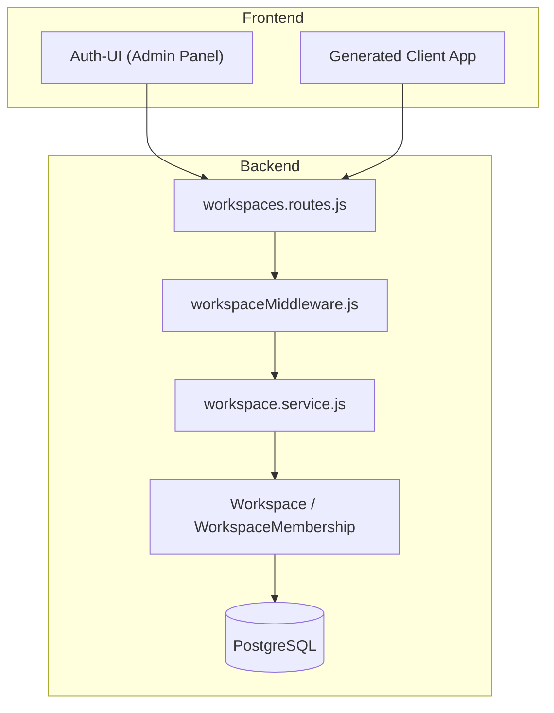

# Workspace Management - Complete Documentation

> **Version:** 1.0  
> **Last Updated:** January 2026  
> **Scope:** Enterprise-grade workspace management for multi-tenant SSO platform

---

## Table of Contents

1. [Overview](#overview)
2. [Architecture](#architecture)
3. [Database Schema](#database-schema)
4. [Constants & Configuration](#constants--configuration)
5. [API Reference](#api-reference)
6. [Service Layer](#service-layer)
7. [Middleware & RBAC](#middleware--rbac)
8. [Frontend Components](#frontend-components)
9. [CLI Tools Integration](#cli-tools-integration)
10. [Usage Examples](#usage-examples)
11. [Error Handling](#error-handling)
12. [Best Practices](#best-practices)

---

## Overview

Workspaces are **organizational sub-units** that allow teams within an organization to collaborate on projects. They provide:

- **Isolation**: Each workspace has its own members and settings
- **Role-Based Access**: Admin, Editor, Viewer roles within each workspace
- **Invitations**: Email-based invitation system
- **Audit Trail**: All actions are logged

### Hierarchy

```
Organization (Tenant)
├── Workspace A (Project Alpha)
│   ├── Admin: user1@example.com
│   ├── Editor: user2@example.com
│   └── Viewer: user3@example.com
├── Workspace B (Project Beta)
│   └── ...
└── Workspace C (Marketing Team)
    └── ...
```

### Key Features

| Feature                | Description                                 |
| ---------------------- | ------------------------------------------- |
| **Maximum Workspaces** | Configurable per org (default: 5)           |
| **Unique Slugs**       | URL-friendly identifiers, unique within org |
| **Soft Deletes**       | Workspaces are never hard-deleted           |
| **Email Invitations**  | 7-day expiry, one-time use codes            |

---

## Architecture

### Component Diagram



### Request Flow

1. **Client** sends request with JWT token
2. **authMiddleware** validates JWT
3. **requireOrgPermission** (for creation) OR **requireWorkspaceAccess** (for existing)
4. **WorkspaceService** performs business logic
5. **ResponseHandler** returns standardized response

---

## Database Schema

### `workspaces` Table

| Column        | Type         | Constraints                     | Description          |
| ------------- | ------------ | ------------------------------- | -------------------- |
| `id`          | UUID         | PK, auto-generated              | Workspace ID         |
| `org_id`      | UUID         | FK → organizations.id, NOT NULL | Parent organization  |
| `name`        | VARCHAR(100) | NOT NULL, 2-100 chars           | Display name         |
| `slug`        | VARCHAR(50)  | NOT NULL, unique per org        | URL-friendly ID      |
| `description` | TEXT         | Nullable                        | Optional description |
| `settings`    | JSONB        | Default: `{}`                   | Custom settings      |
| `created_by`  | UUID         | FK → user_metadata.id           | Creator's user ID    |
| `created_at`  | TIMESTAMP    | Auto                            | Creation timestamp   |
| `updated_at`  | TIMESTAMP    | Auto                            | Last update          |
| `deleted_at`  | TIMESTAMP    | Nullable                        | Soft delete marker   |

**Indexes:**
- `idx_workspaces_org_id` on `org_id`
- `idx_workspaces_org_slug` UNIQUE on `(org_id, slug)`
- `idx_workspaces_deleted` on `deleted_at`

### `workspace_memberships` Table

| Column         | Type      | Constraints                      | Description           |
| -------------- | --------- | -------------------------------- | --------------------- |
| `id`           | UUID      | PK, auto-generated               | Membership ID         |
| `workspace_id` | UUID      | FK → workspaces.id, NOT NULL     | Target workspace      |
| `user_id`      | UUID      | FK → user_metadata.id, NOT NULL  | Member's user ID      |
| `role`         | ENUM      | `viewer`, `editor`, `admin`      | Access level          |
| `status`       | ENUM      | `active`, `invited`, `suspended` | Membership status     |
| `created_by`   | UUID      | Nullable                         | Who added this member |
| `created_at`   | TIMESTAMP | Auto                             | Join timestamp        |
| `updated_at`   | TIMESTAMP | Auto                             | Last update           |

**Indexes:**
- `idx_ws_membership_workspace` on `workspace_id`
- `idx_ws_membership_user` on `user_id`
- `idx_ws_membership_unique` UNIQUE on `(workspace_id, user_id)`

---

## Constants & Configuration

### Location: `auth-service/config/constants.js`

```javascript
// Workspace Roles (Context-level access)
const WORKSPACE_ROLES = {
    ADMIN: 'admin',
    EDITOR: 'editor',
    VIEWER: 'viewer',
};

// Member Status
const MEMBER_STATUS = {
    ACTIVE: 'active',
    PENDING: 'pending',
    SUSPENDED: 'suspended',
    INVITED: 'invited',
};

// Invitation Status
const INVITATION_STATUS = {
    PENDING: 'pending',
    ACCEPTED: 'accepted',
    EXPIRED: 'expired',
    REVOKED: 'revoked',
};

// System Limits
const SYSTEM_LIMITS = {
    MAX_WORKSPACES_PER_ORG: parseInt(process.env.MAX_WORKSPACES_PER_ORG || '5', 10),
    INVITATION_EXPIRY_DAYS: 7,
};
```

### Environment Variables

| Variable                 | Default | Description                         |
| ------------------------ | ------- | ----------------------------------- |
| `MAX_WORKSPACES_PER_ORG` | 5       | Maximum workspaces per organization |

---

## API Reference

**Base URL:** `/api/workspaces`

### Workspace CRUD

| Method | Endpoint          | Auth            | Description            |
| ------ | ----------------- | --------------- | ---------------------- |
| GET    | `/`               | JWT             | List user's workspaces |
| GET    | `/?org_id={uuid}` | JWT             | List workspaces in org |
| POST   | `/`               | JWT + Org Admin | Create workspace       |
| GET    | `/:id`            | JWT + Member    | Get workspace          |
| PUT    | `/:id`            | JWT + WS Admin  | Update workspace       |
| DELETE | `/:id`            | JWT + WS Admin  | Soft delete            |

### Member Management

| Method | Endpoint               | Auth           | Description   |
| ------ | ---------------------- | -------------- | ------------- |
| GET    | `/:id/members`         | JWT + Member   | List members  |
| POST   | `/:id/members`         | JWT + WS Admin | Add member    |
| PUT    | `/:id/members/:userId` | JWT + WS Admin | Update role   |
| DELETE | `/:id/members/:userId` | JWT + WS Admin | Remove member |

### Invitations

| Method | Endpoint                        | Auth           | Description        |
| ------ | ------------------------------- | -------------- | ------------------ |
| POST   | `/:id/invitations`              | JWT + WS Admin | Send invitation    |
| GET    | `/:id/invitations`              | JWT + WS Admin | List invitations   |
| DELETE | `/:id/invitations/:invId`       | JWT + WS Admin | Revoke             |
| GET    | `/invitations/preview?code=xxx` | JWT            | Preview invitation |
| POST   | `/invitations/accept`           | JWT            | Accept invitation  |

### Request/Response Examples

#### Create Workspace

**Request:**
```http
POST /api/workspaces
Content-Type: application/json
Authorization: Bearer <jwt>

{
  "org_id": "550e8400-e29b-41d4-a716-446655440000",
  "name": "Marketing Team",
  "slug": "marketing-team",
  "description": "Q1 Campaign workspace"
}
```

**Response:**
```json
{
  "success": true,
  "statusCode": 201,
  "data": {
    "id": "123e4567-e89b-12d3-a456-426614174000",
    "org_id": "550e8400-e29b-41d4-a716-446655440000",
    "name": "Marketing Team",
    "slug": "marketing-team",
    "description": "Q1 Campaign workspace",
    "created_by": "user-uuid",
    "created_at": "2026-01-13T10:00:00Z"
  }
}
```

#### Send Invitation

**Request:**
```http
POST /api/workspaces/123e4567.../invitations
Content-Type: application/json

{
  "email": "newuser@example.com",
  "role": "editor",
  "message": "Join our marketing workspace!"
}
```

---

## Service Layer

### Location: `auth-service/services/workspace.service.js`

The `WorkspaceService` class provides all business logic:

| Method                                                                  | Description           |
| ----------------------------------------------------------------------- | --------------------- |
| `createWorkspace({ userId, orgId, name, slug, description })`           | Create new workspace  |
| `getUserWorkspaces(userId, orgId?)`                                     | Get user's workspaces |
| `getWorkspaceById(workspaceId, userId)`                                 | Get single workspace  |
| `updateWorkspace({ requesterId, workspaceId, name, description })`      | Update details        |
| `deleteWorkspace({ requesterId, workspaceId })`                         | Soft delete           |
| `addMember({ requesterId, workspaceId, targetUserId, role })`           | Add member            |
| `getMembers(workspaceId)`                                               | List members          |
| `removeMember({ requesterId, workspaceId, targetUserId })`              | Remove member         |
| `updateMemberRole({ requesterId, workspaceId, targetUserId, newRole })` | Change role           |
| `sendInvitation({ requesterId, workspaceId, email, role, message })`    | Email invite          |
| `getInvitations(workspaceId)`                                           | List pending invites  |
| `revokeInvitation({ requesterId, workspaceId, invitationId })`          | Cancel invite         |
| `acceptInvitation({ code, userId })`                                    | Accept invite         |
| `getInvitationByCode(code)`                                             | Preview invite        |

### Key Business Rules

1. **Workspace Creation:**
   - User must be `admin` or `owner` of the organization
   - Slug must be unique within the organization
   - Maximum workspaces limit is enforced

2. **Member Management:**
   - Creator is automatically added as `admin`
   - Admins cannot demote themselves
   - At least one admin must remain

3. **Invitations:**
   - 7-day expiry
   - One-time use codes (SHA256 hash stored)
   - Email is sent via `EmailService`

---

## Middleware & RBAC

### Location: `auth-service/middleware/workspaceMiddleware.js`

#### `requireWorkspaceAccess(requiredRole)`

Checks if user is a member of the workspace with sufficient role.

```javascript
// Hierarchy: admin > editor > viewer
router.get('/:id', requireWorkspaceAccess(), ...);           // Any member
router.put('/:id', requireWorkspaceAccess('admin'), ...);    // Admin only
```

**Attaches to `req`:**
- `req.workspace` - Workspace instance
- `req.workspaceMembership` - User's membership

#### `requireOrgPermission(requiredRole)`

Checks if user has permission in the **organization** (for creating workspaces).

```javascript
// Hierarchy: owner > admin > member
router.post('/', requireOrgPermission('admin'), ...);  // Org admin can create
```

**Attaches to `req`:**
- `req.orgMembership` - User's org membership
- `req.targetOrgId` - Organization ID

---

## Frontend Components

### Admin Panel (auth-ui)

| Component                    | Path                 | Description            |
| ---------------------------- | -------------------- | ---------------------- |
| `OrganizationDetail.jsx`     | `/organizations/:id` | Org detail with tabs   |
| `OrganizationWorkspaces.jsx` | (Tab component)      | List/create workspaces |
| `CreateWorkspaceModal.jsx`   | (Modal)              | Create new workspace   |

#### OrganizationDetail Features

- **Tabs:** Workspaces, Members, Settings
- **Navigation:** Click org name in list → detail view
- **Actions:** Create workspace button (for admins)

### Client Apps (sso-cli-tools)

| Template                                | Output                                                   | Description          |
| --------------------------------------- | -------------------------------------------------------- | -------------------- |
| `api/workspaces.tpl`                    | `src/api/workspaces.js`                                  | API helper           |
| `components/OrganizationWorkspaces.tpl` | `src/components/organization/OrganizationWorkspaces.jsx` | Workspace list       |
| `components/OrganizationManager.tpl`    | `src/components/organization/OrganizationManager.jsx`    | Tabs with workspaces |

---

## CLI Tools Integration

### Commands

```bash
# Initialize new client app with workspace support
sso-client init
# → Enable "requiresOrganization" → "workspaces" feature

# Generate UI for existing client
sso-client generate-ui my-client-key
```

### Generated Files

When organization support is enabled:

```
src/
├── api/
│   ├── organizations.js
│   └── workspaces.js          # NEW
├── components/
│   └── organization/
│       ├── OrganizationManager.jsx
│       ├── OrganizationSwitcher.jsx
│       └── OrganizationWorkspaces.jsx  # NEW
└── ...
```

---

## Usage Examples

### 1. Create Workspace (Frontend)

```javascript
import { createWorkspace } from '../api/workspaces';

const handleCreate = async () => {
  const workspace = await createWorkspace({
    org_id: currentOrg.id,
    name: 'New Project',
    slug: 'new-project',
    description: 'My new workspace'
  });
  console.log('Created:', workspace);
};
```

### 2. List Workspaces (Frontend)

```javascript
import { getWorkspaces } from '../api/workspaces';

useEffect(() => {
  getWorkspaces(orgId).then(setWorkspaces);
}, [orgId]);
```

### 3. Backend Service Call

```javascript
const WorkspaceService = require('../services/workspace.service');

// Create workspace
const workspace = await WorkspaceService.createWorkspace({
  userId: req.user.id,
  orgId: 'org-uuid',
  name: 'Engineering',
  slug: 'engineering',
  description: 'Engineering team workspace'
});

// Send invitation
const invitation = await WorkspaceService.sendInvitation({
  requesterId: req.user.id,
  workspaceId: workspace.id,
  email: 'newdev@example.com',
  role: 'editor',
  message: 'Welcome to the team!'
});
```

---

## Error Handling

### Common Error Codes

| Code                           | HTTP | Description                |
| ------------------------------ | ---- | -------------------------- |
| `MAX_WORKSPACES_REACHED`       | 400  | Org limit exceeded         |
| `DUPLICATE_SLUG`               | 409  | Slug already exists in org |
| `INSUFFICIENT_ORG_PERMISSIONS` | 403  | Not org admin/owner        |
| `WORKSPACE_ACCESS_DENIED`      | 403  | Not a workspace member     |
| `INSUFFICIENT_PERMISSIONS`     | 403  | Role too low               |
| `NOT_ORG_MEMBER`               | 403  | Not in organization        |
| `INVITATION_EXPIRED`           | 400  | Invite expired             |
| `INVITATION_ALREADY_USED`      | 400  | Code reused                |
| `ALREADY_MEMBER`               | 409  | User already in workspace  |

### Error Response Format

```json
{
  "success": false,
  "statusCode": 403,
  "message": "Insufficient permissions. Required: admin, You have: viewer",
  "error": {
    "code": "INSUFFICIENT_PERMISSIONS"
  },
  "meta": {
    "timestamp": "2026-01-13T10:00:00Z",
    "requestId": "abc123",
    "path": "/api/workspaces/xxx/members"
  }
}
```

---

## Best Practices

### 1. Always Use Constants

```javascript
// ✅ Good
const { WORKSPACE_ROLES } = require('../config/constants');
membership.role = WORKSPACE_ROLES.EDITOR;

// ❌ Bad
membership.role = 'editor';
```

### 2. Use Validators

```javascript
// ✅ Good - Use Joi schemas
const { error, value } = createWorkspaceSchema.validate(req.body);
if (error) return ResponseHandler.error(res, error.details[0].message, 400);

// ❌ Bad - Manual validation
if (!req.body.name) return res.status(400).send('Name required');
```

### 3. Transactions for Multi-Step Operations

```javascript
// ✅ Good - Use transactions
const transaction = await sequelize.transaction();
try {
  const workspace = await Workspace.create({ ... }, { transaction });
  await WorkspaceMembership.create({ ... }, { transaction });
  await transaction.commit();
} catch (error) {
  await transaction.rollback();
  throw error;
}
```

### 4. Consistent Response Format

Always use `ResponseHandler`:

```javascript
return ResponseHandler.success(res, data);
return ResponseHandler.created(res, data);
return ResponseHandler.error(res, message, statusCode);
```

---

## Quick Reference Card

```
┌─────────────────────────────────────────────────────────────┐
│                    WORKSPACE QUICK REF                      │
├─────────────────────────────────────────────────────────────┤
│ ROLES:        admin > editor > viewer                       │
│ ORG ROLES:    owner > admin > member                        │
│ MAX_WS/ORG:   5 (env: MAX_WORKSPACES_PER_ORG)               │
│ INVITE_EXPIRY: 7 days                                       │
├─────────────────────────────────────────────────────────────┤
│ CREATE:       POST /api/workspaces (Org Admin+)             │
│ LIST:         GET /api/workspaces?org_id=xxx                │
│ INVITE:       POST /api/workspaces/:id/invitations          │
│ ACCEPT:       POST /api/workspaces/invitations/accept       │
└─────────────────────────────────────────────────────────────┘
```

---

**Author:** Enterprise SSO Platform Team  
**License:** MIT
