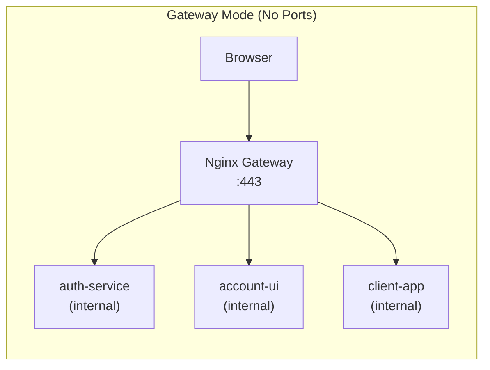
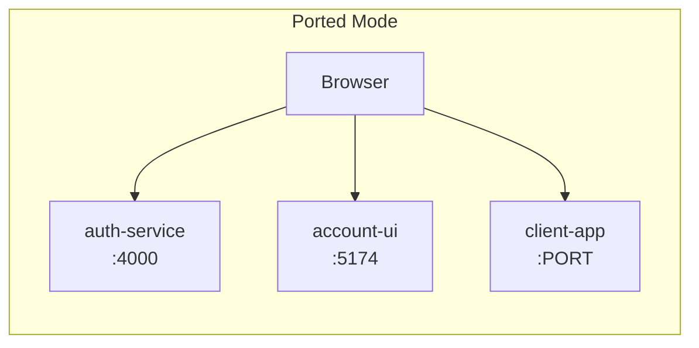
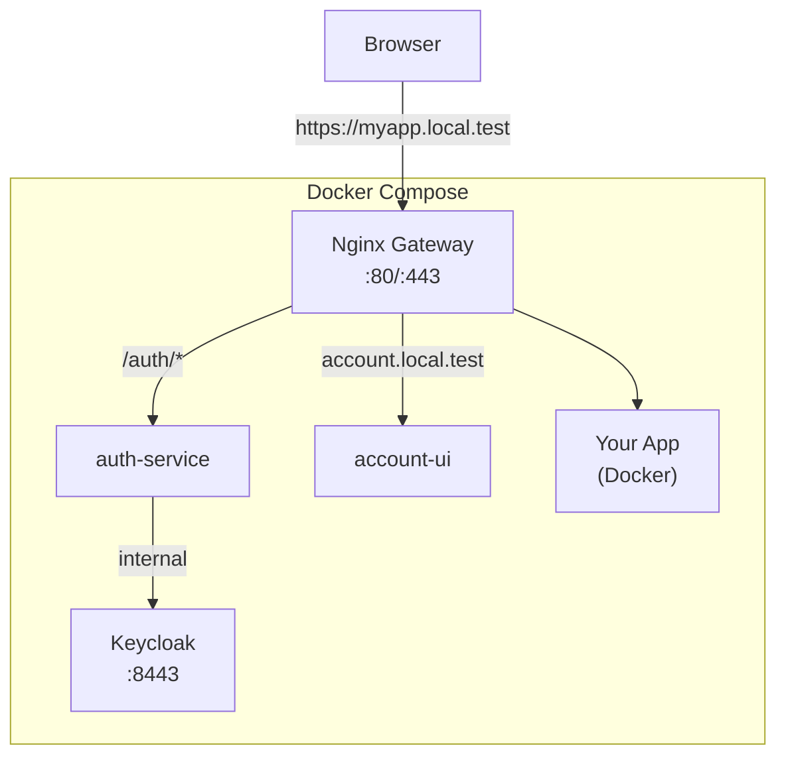
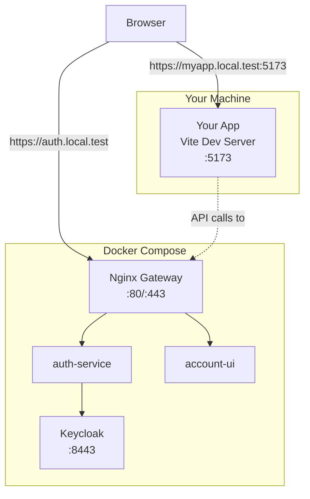
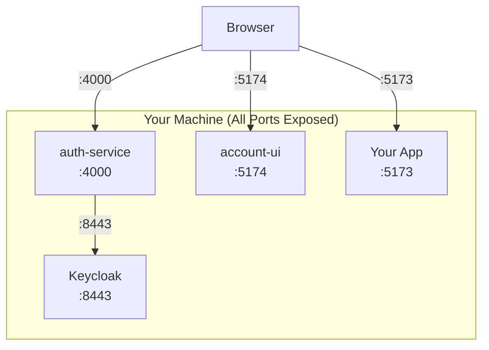

# SSO CLI Tools - Deployment Modes Guide

This guide explains the three deployment modes supported by `sso-cli-tools` and helps you choose the right one for your development workflow.

---

## Quick Summary

| Mode                 | Client App              | Auth Infrastructure     | Best For                |
| -------------------- | ----------------------- | ----------------------- | ----------------------- |
| **Docker Mode**      | Docker (behind gateway) | Docker (behind gateway) | Production-like testing |
| **Hybrid Mode** ⭐    | Local (Vite dev server) | Docker (behind gateway) | **Daily development**   |
| **Fully Local Mode** | Local (Vite dev server) | Local (with ports)      | No Docker environment   |

---

## Architecture Overview

### What is "Behind Gateway"?

The **nginx gateway** is a reverse proxy that routes all traffic through ports 80/443. This means:
- All services use **clean URLs without ports** (e.g., `https://auth.local.test`)
- SSL/HTTPS is handled by the gateway
- Services communicate internally via Docker network



### What is "With Ports"?

When services run **with ports**, each service exposes its own port to the host:
- auth-service: `https://auth.local.test:4000`
- account-ui: `https://account.local.test:5174`
- Your client: `https://client.local.test:PORT`



---

## Mode 1: Docker Mode (Full Dockerized)

**Use when:** You want to test your client app exactly as it will run in production.

### Configuration

| Setting             | Value                                      |
| ------------------- | ------------------------------------------ |
| `generateDocker`    | `true` (answer Yes to Docker files prompt) |
| `authBehindGateway` | `true` (default)                           |

### URLs Generated

| URL Type            | Example                                       |
| ------------------- | --------------------------------------------- |
| Client App          | `https://myapp.local.test` (no port)          |
| Auth Base URL       | `https://auth.local.test/auth`                |
| Account UI          | `https://account.local.test`                  |
| Callback (Keycloak) | `https://auth.local.test/auth/callback/myapp` |

### How to Use

```bash
sso-client init
# Answer "Yes" to "Generate Docker files?"

# Then add your service to docker-compose.yml
# Copy the generated docker-compose.snippet.yml
```

### Architecture Diagram



---

## Mode 2: Hybrid Mode ⭐ (Recommended for Development)

**Use when:** You're actively developing a client app and need fast hot-reload, but want to use the existing auth infrastructure in Docker.

### Configuration

| Setting             | Value                                      |
| ------------------- | ------------------------------------------ |
| `generateDocker`    | `false` (answer No to Docker files prompt) |
| `authBehindGateway` | `true` (default)                           |

### URLs Generated

| URL Type            | Example                                                 |
| ------------------- | ------------------------------------------------------- |
| Client App          | `https://myapp.local.test:5173` (with port)             |
| Auth Base URL       | `https://auth.local.test/auth` (no port)                |
| Account UI          | `https://account.local.test` (no port)                  |
| Callback (Keycloak) | `https://auth.local.test/auth/callback/myapp` (no port) |

### How to Use

```bash
# Start Docker infrastructure
cd /path/to/complete-repo
sudo docker compose up -d

# Create your client app
npm create vite@latest my-app -- --template react
cd my-app

# Initialize SSO (answer No to Docker)
sso-client init

# Run locally
npm run dev
```

### Architecture Diagram



### Why This is Recommended

1. **Fast Development**: Vite's hot reload works instantly
2. **Production-like Auth**: Auth flow matches production exactly
3. **Easy Setup**: Just `docker compose up` + `npm run dev`
4. **Cookie Sharing**: Same `.local.test` domain works for all services

---

## Mode 3: Fully Local Mode

**Use when:** You don't have Docker or want to run everything locally for debugging.

### Configuration

| Setting             | Value                           |
| ------------------- | ------------------------------- |
| `generateDocker`    | `false`                         |
| `authBehindGateway` | `false` (set via env or config) |

### How to Enable

**Option A: Environment Variable**
```bash
export SSO_AUTH_BEHIND_GATEWAY=false
sso-client init
```

**Option B: Config File**
Create `sso-client.config.json` before running init:
```json
{
  "authBehindGateway": false
}
```

### URLs Generated

| URL Type            | Example                                            |
| ------------------- | -------------------------------------------------- |
| Client App          | `https://myapp.local.test:5173`                    |
| Auth Base URL       | `https://auth.local.test:4000/auth`                |
| Account UI          | `https://account.local.test:5174`                  |
| Callback (Keycloak) | `https://auth.local.test:4000/auth/callback/myapp` |

### Architecture Diagram



### Requirements

To run in fully local mode, you need to:
1. Run auth-service locally: `cd auth-service && npm run dev`
2. Run account-ui locally: `cd centralized-login && npm run dev`
3. Run Keycloak locally (or in Docker with port exposed)
4. Run your client app: `npm run dev`

> ⚠️ **Note**: This mode requires more setup and is not recommended unless you need to debug the auth-service itself.

---

## Configuration Reference

### SSO_CONFIG Settings

| Setting             | Env Variable              | Default      | Description                                |
| ------------------- | ------------------------- | ------------ | ------------------------------------------ |
| `protocol`          | `SSO_PROTOCOL`            | `https`      | HTTP or HTTPS                              |
| `domain`            | `SSO_DOMAIN`              | `local.test` | Base domain                                |
| `dockerMode`        | `SSO_DOCKER_MODE`         | `false`      | Enable portless URLs for client            |
| `authBehindGateway` | `SSO_AUTH_BEHIND_GATEWAY` | `true`       | Auth uses gateway (portless)               |
| `authServicePort`   | `SSO_AUTH_PORT`           | `4000`       | Auth service port (when not using gateway) |
| `accountUiPort`     | `SSO_ACCOUNT_UI_PORT`     | `5174`       | Account UI port (when not using gateway)   |

### URL Generation Logic

```
IF generateDocker = true OR dockerMode = true:
    Client URL = https://client.local.test (no port)
ELSE:
    Client URL = https://client.local.test:PORT

IF authBehindGateway = true OR dockerMode = true:
    Auth URLs = https://auth.local.test (no port)
ELSE:
    Auth URLs = https://auth.local.test:4000
```

---

## Troubleshooting

### "Invalid redirect_uri" in Keycloak

**Cause**: Mismatch between what auth-service sends and what Keycloak expects.

**Solution**:
1. Check Keycloak client's "Valid redirect URIs"
2. Check database `clients.callback_url`
3. Restart auth-service to clear cached passport strategies:
   ```bash
   sudo docker restart sso-auth-service
   ```

### "ERR_CONNECTION_REFUSED"

**Cause**: Trying to access a service that's not exposed or running.

**Solutions**:
- For gateway mode: Ensure Docker Compose is running
- For ported mode: Ensure the specific service is running and port is exposed
- Check `/etc/hosts` has the domain entry

### SSL Certificate Errors

**Cause**: Self-signed certificates not trusted.

**Solutions**:
- Use `mkcert` to create trusted local certificates
- Or add `NODE_TLS_REJECT_UNAUTHORIZED=0` to `.env` (dev only!)

---

## Quick Decision Guide

```
┌─────────────────────────────────────┐
│ Are you developing a client app?   │
└─────────────┬───────────────────────┘
              │
              ▼
       ┌──────┴──────┐
       │     Yes     │
       └──────┬──────┘
              │
              ▼
┌─────────────────────────────────────┐
│ Is Docker available?                │
└─────────────┬───────────────────────┘
              │
    ┌─────────┴─────────┐
    ▼                   ▼
┌───────┐           ┌───────┐
│  Yes  │           │  No   │
└───┬───┘           └───┬───┘
    │                   │
    ▼                   ▼
┌─────────────┐   ┌─────────────┐
│ Hybrid Mode │   │ Fully Local │
│     ⭐       │   │    Mode     │
└─────────────┘   └─────────────┘
```

---

## Summary

| Scenario                 | `generateDocker` | `authBehindGateway` | Command                                         |
| ------------------------ | ---------------- | ------------------- | ----------------------------------------------- |
| Docker (production-like) | `true`           | `true`              | `sso-client init` → Yes to Docker               |
| Hybrid (recommended)     | `false`          | `true`              | `sso-client init` → No to Docker                |
| Fully Local              | `false`          | `false`             | `SSO_AUTH_BEHIND_GATEWAY=false sso-client init` |
