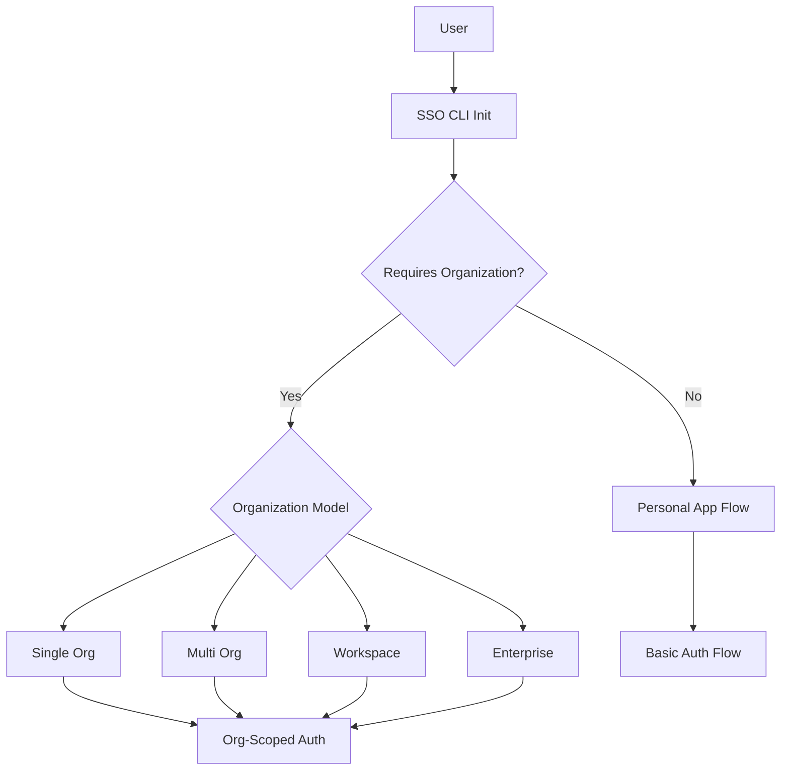
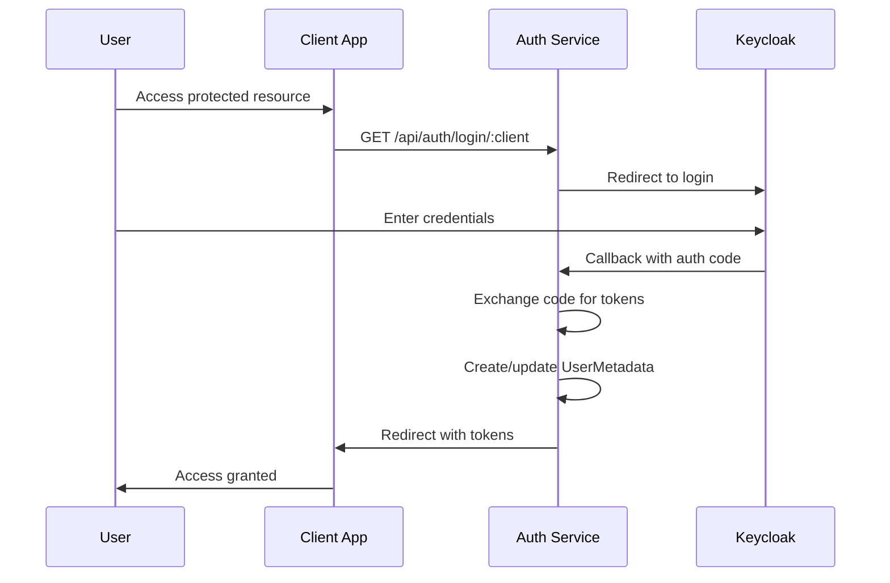
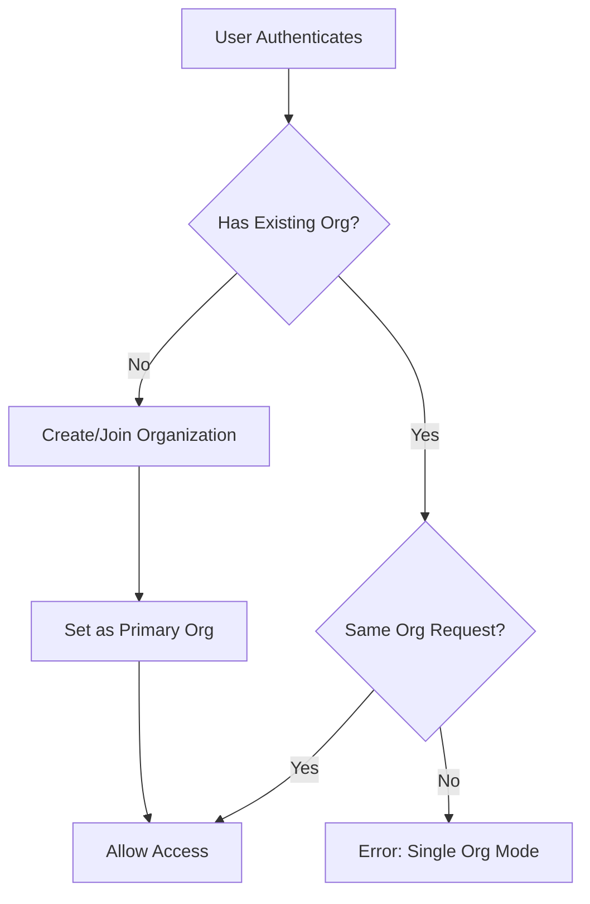
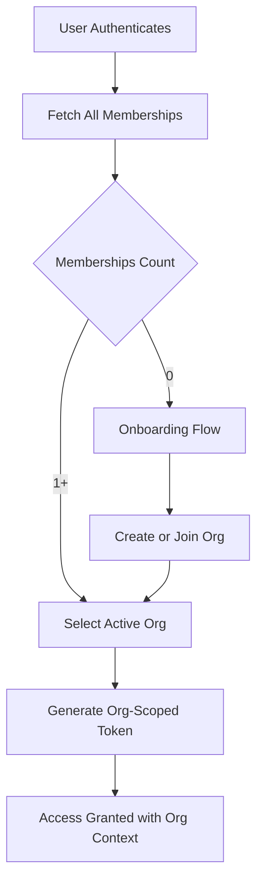
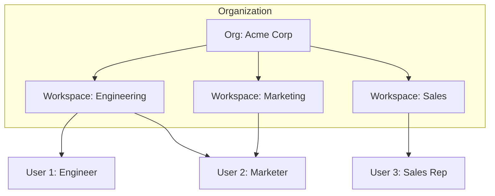
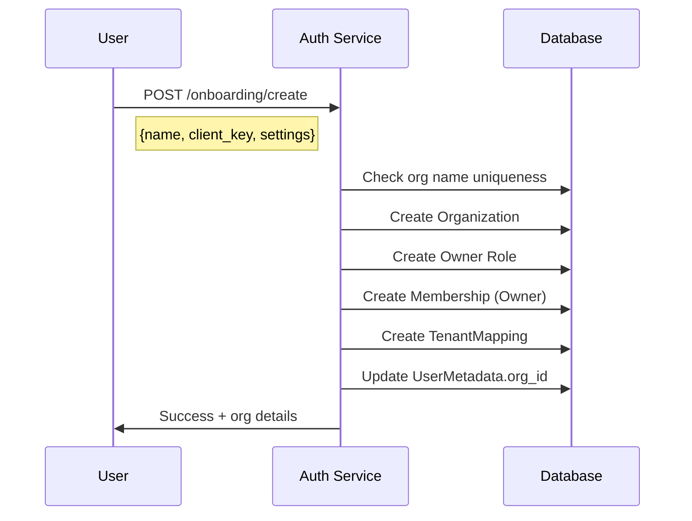
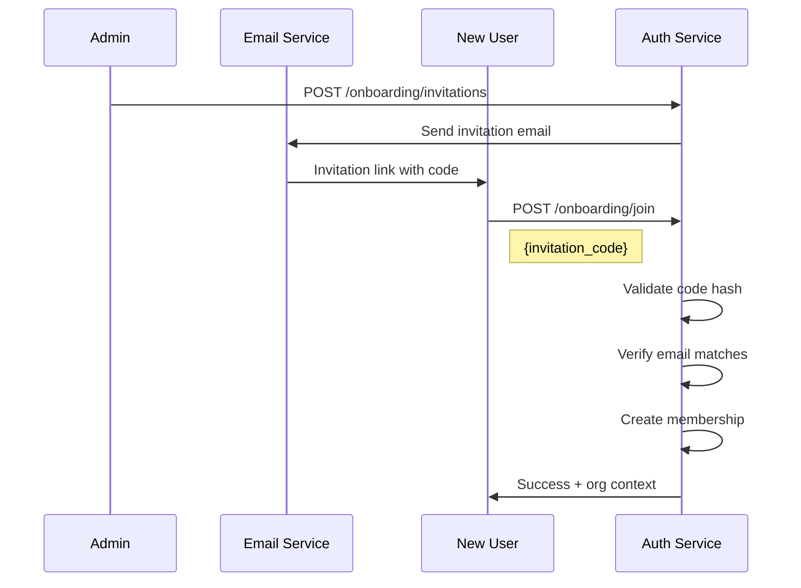
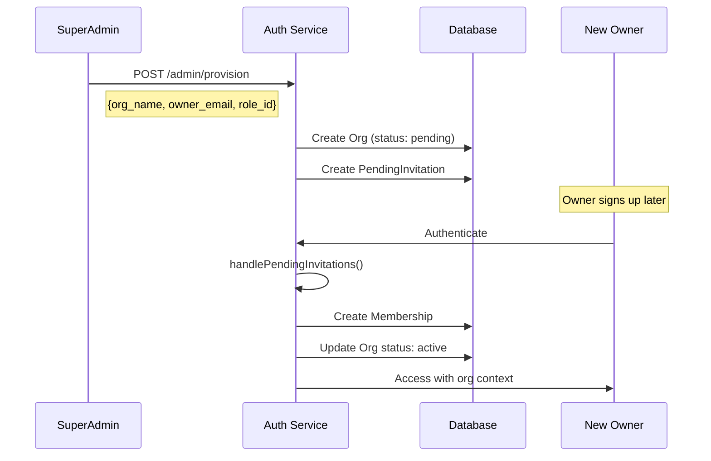
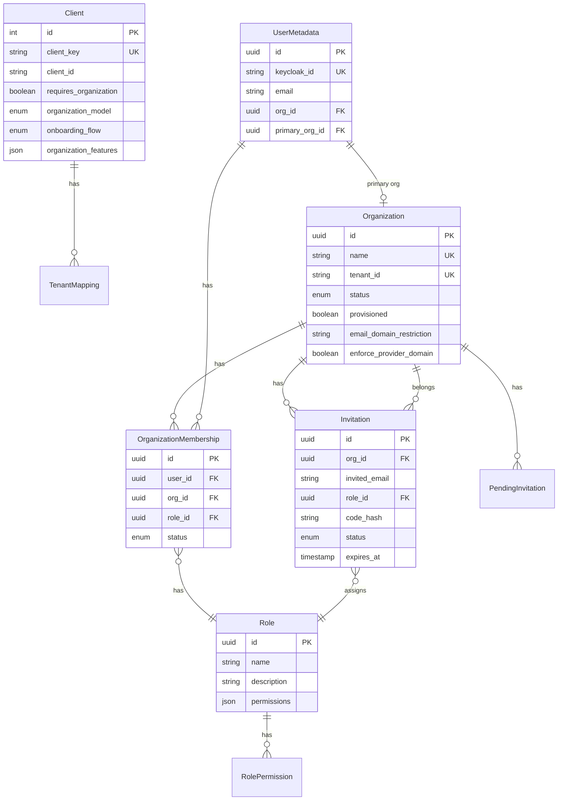
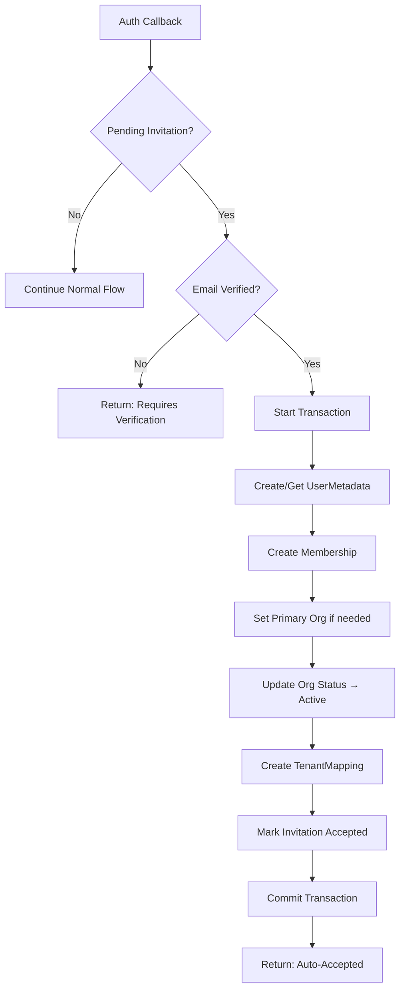

# SSO CLI Tools - Authentication Flows Report

## Executive Summary

This report provides a comprehensive analysis of the SSO CLI tools authentication flows in the `auth-service` backend. The system supports **two primary authentication patterns**: flows with organization context and flows without organization context. Within organization-based flows, there are **four organizational models**: Single, Multi, Workspace, and Enterprise.

---

## Table of Contents

1. [Authentication Flow Overview](#authentication-flow-overview)
2. [Flow Without Organization](#flow-without-organization)
3. [Flow With Organization](#flow-with-organization)
   - [Organization Models](#organization-models)
   - [Single Organization Mode](#1-single-organization-mode)
   - [Multiple Organization Mode](#2-multiple-organization-mode)
   - [Workspace Mode](#3-workspace-mode)
   - [Enterprise Mode](#4-enterprise-mode)
4. [Onboarding Flows](#onboarding-flows)
5. [Key API Endpoints](#key-api-endpoints)
6. [Data Models](#data-models)
7. [Architecture Diagram](#architecture-diagram)

---

## Authentication Flow Overview

The SSO system uses **Keycloak** as the identity provider with a **Passport.js** integration for OAuth2/OIDC flows. The authentication architecture supports:



### CLI Configuration ([init.js](file:///home/sr-user91/Desktop/SSO/sso-cli-tools/lib/commands/init.js))

When developers run `sso-client init`, they configure:

| Configuration | Options | Description |
|--------------|---------|-------------|
| `requiresOrganization` | `true/false` | Whether users must belong to an organization |
| `organizationModel` | `single`, `multi` | How users relate to organizations |
| `onboardingFlow` | `create_org`, `invitation_only`, `domain_matching`, `flexible` | How new users join |
| `organizationFeatures` | Array of features | Enabled capabilities |

---

## Flow Without Organization

**Use Case**: Personal applications, developer tools, or apps where team/organization context is not required.

### Sequence Diagram



### Key Characteristics

- **No tenant context** required in token claims
- **UserMetadata** created without `org_id`
- No membership or role restrictions beyond basic authentication
- Simpler callback flow - no organization checks

### Relevant Code Paths

| File | Purpose |
|------|---------|
| [auth.routes.js](file:///home/sr-user91/Desktop/SSO/auth-service/routes/auth/auth.routes.js#L206-L252) | Login/callback handling |
| [passport.service.js](file:///home/sr-user91/Desktop/SSO/auth-service/services/passport.service.js) | Strategy configuration |

---

## Flow With Organization

When `requires_organization: true`, the system enforces organizational context throughout the authentication lifecycle.

### Organization Models

The [Client model](file:///home/sr-user91/Desktop/SSO/auth-service/models/client.js#L54-L58) defines four organization models:

```javascript
organization_model: {
  type: DataTypes.ENUM('single', 'multi', 'workspace', 'enterprise'),
  allowNull: true
}
```

---

### 1. Single Organization Mode

**Use Case**: Apps where each user belongs to exactly **one organization at a time**.

#### Behavior

- Users can create OR join only one organization
- Attempting to join a second organization fails with `SINGLE_ORGANIZATION_MODE` error
- Switching organizations requires leaving the current one first

#### Enforcement Logic ([memberships.routes.js](file:///home/sr-user91/Desktop/SSO/auth-service/routes/organizations/memberships.routes.js#L244-L271))

```javascript
// Single org mode enforcement
if (clientOrgModel === 'single') {
  const existsInDifferentOrg = userExistingMemberships.some(
    membership => membership.org_id !== org_id
  );

  if (existsInDifferentOrg) {
    throw new AppError(
      'This application only allows users to belong to one organization.',
      409, 
      'SINGLE_ORGANIZATION_MODE'
    );
  }
}
```

#### Flow Diagram



---

### 2. Multiple Organization Mode

**Use Case**: SaaS platforms, consulting firms, agencies where users work across multiple clients/projects.

#### Behavior

- Users can belong to **multiple organizations simultaneously**
- Each membership has an independent role
- Users have a **primary organization** (`primary_org_id`)
- Can switch between organizations without leaving

#### Data Model

| Table | Fields | Purpose |
|-------|--------|---------|
| `organization_memberships` | `user_id`, `org_id`, `role_id` | Many-to-many link |
| `user_metadata` | `org_id`, `primary_org_id` | Current/primary org tracking |

#### Key Features

- **Role per Organization**: User can be `Owner` in Org A, `Member` in Org B
- **Organization Context Switching**: Token can request specific org context
- **Bulk Assignment**: [/bulk-assign](file:///home/sr-user91/Desktop/SSO/auth-service/routes/organizations/memberships.routes.js#L424-L513) endpoint for mass invites

#### User Memberships Query ([memberships.routes.js](file:///home/sr-user91/Desktop/SSO/auth-service/routes/organizations/memberships.routes.js#L516-L582))

```javascript
// GET /api/organization-memberships/user/:userId
const memberships = await OrganizationMembership.findAll({
  where: { user_id: userId },
  include: [
    { model: Organization, attributes: ['id', 'name', 'tenant_id'] },
    { model: Role, include: [{ model: Permission, as: 'Permissions' }] }
  ]
});
```

#### Flow Diagram



---

### 3. Workspace Mode

**Use Case**: Collaborative platforms like Slack, Notion where organizations have internal workspaces/teams.

#### Characteristics

> [!NOTE]
> Workspace mode is defined in the enum but **not fully implemented** in the current codebase. It's available for future extension.

- Organizations contain nested **workspaces**
- Users can be members of specific workspaces within an org
- Hierarchical permissions: Org Admin > Workspace Admin > Member

#### Proposed Structure



---

### 4. Enterprise Mode

**Use Case**: Large enterprises with complex SSO requirements, multiple identity providers, and strict governance.

#### Characteristics

> [!IMPORTANT]
> Enterprise mode is defined in the enum but requires additional implementation for:
> - Multi-IdP support per organization
> - SCIM provisioning
> - Cross-organization trust relationships

---

## Onboarding Flows

The system supports four onboarding methods configured via `onboarding_flow`:

### 1. Create New Organization (`create_org`)

**Endpoint**: [POST /api/onboarding/create](file:///home/sr-user91/Desktop/SSO/auth-service/routes/organizations/onboarding.routes.js#L97-L267)



#### Required Payload

```json
{
  "name": "My Company",
  "client_key": "my-app",
  "description": "Optional description",
  "settings": {}
}
```

---

### 2. Join by Invitation (`invitation_only`)

**Endpoint**: [POST /api/onboarding/join](file:///home/sr-user91/Desktop/SSO/auth-service/routes/organizations/onboarding.routes.js#L271-L457)



#### Security Features

- **Code Hashing**: Invitation codes are stored as SHA-256 hashes
- **Email Verification Required**: `email_verified` must be true
- **Email Matching**: Invitation email must match authenticated user's email
- **Expiration**: Configurable (1-30 days)

---

### 3. Domain Matching (`domain_matching`)

**Concept**: Auto-join organizations based on email domain (e.g., all `@acme.com` users join Acme Corp automatically).

#### Organization Settings ([Organization.js](file:///home/sr-user91/Desktop/SSO/auth-service/models/Organization.js#L76-L89))

```javascript
require_workspace_email: {
  type: DataTypes.BOOLEAN,
  defaultValue: false,
  comment: 'Require users to sign up with workspace/business email'
},
email_domain_restriction: {
  type: DataTypes.STRING(100),
  allowNull: true,
  comment: 'Required email domain (e.g., @company.com)'
},
enforce_provider_domain: {
  type: DataTypes.BOOLEAN,
  defaultValue: false,
  comment: 'Enforce workspace accounts (Google Workspace, not Gmail)'
}
```

---

### 4. Flexible (`flexible`)

Combines all options - users can:
- Create a new organization
- Accept an invitation
- Auto-join via domain matching

---

## Admin-Provisioned Organizations

**Endpoint**: [POST /api/onboarding/admin/provision](file:///home/sr-user91/Desktop/SSO/auth-service/routes/organizations/onboarding.routes.js#L830-L940)

**Use Case**: Enterprise scenarios where admins pre-create organizations before users sign up.



---

## Key API Endpoints

### Authentication Routes

| Method | Endpoint | Purpose |
|--------|----------|---------|
| GET | `/api/auth/login/:client` | Initiate OAuth flow |
| GET | `/api/auth/callback/:client` | Handle OAuth callback |
| POST | `/api/auth/refresh` | Refresh access token |
| POST | `/api/auth/logout` | Logout and revoke tokens |

### Organization Routes

| Method | Endpoint | Purpose |
|--------|----------|---------|
| GET | `/api/organizations` | List all organizations |
| GET | `/api/organizations/:id` | Get organization details |
| POST | `/api/organizations` | Create organization |
| PUT | `/api/organizations/:id` | Update organization |
| DELETE | `/api/organizations/:id` | Delete organization |

### Onboarding Routes

| Method | Endpoint | Purpose |
|--------|----------|---------|
| POST | `/api/onboarding/create` | Self-service org creation |
| POST | `/api/onboarding/join` | Join via invitation code |
| POST | `/api/onboarding/accept-pending` | Accept pending invitation |
| POST | `/api/onboarding/invitations` | Create invitation (admin) |
| GET | `/api/onboarding/invitations` | List pending invitations |
| POST | `/api/onboarding/admin/provision` | Admin provision org |

### Membership Routes

| Method | Endpoint | Purpose |
|--------|----------|---------|
| GET | `/api/organization-memberships` | List all memberships |
| GET | `/api/organization-memberships/:id` | Get membership details |
| POST | `/api/organization-memberships` | Create membership |
| PUT | `/api/organization-memberships/:id` | Update membership role |
| DELETE | `/api/organization-memberships/:id` | Remove membership |
| POST | `/api/organization-memberships/bulk-assign` | Bulk assign users |
| GET | `/api/organization-memberships/user/:userId` | Get user's memberships |
| GET | `/api/organization-memberships/stats/overview` | Membership statistics |

---

## Data Models

### Entity Relationship Diagram



---

## Auth Callback Service

The [AuthCallbackService](file:///home/sr-user91/Desktop/SSO/auth-service/services/auth-callback-service.js) orchestrates organization context during authentication:

### Key Methods

| Method | Purpose |
|--------|---------|
| `handlePendingInvitations()` | Auto-accepts admin-provisioned invitations |
| `checkTenantRequirements()` | Determines if user needs org context |
| `getUserOrganizationContext()` | Gets user's full org membership tree |
| `hasOrganizationAccess()` | Validates user access to specific org |
| `ensureUserMetadata()` | Creates/updates user record |

### Auto-Join Flow ([auth-callback-service.js](file:///home/sr-user91/Desktop/SSO/auth-service/services/auth-callback-service.js#L20-L182))



---

## Summary Matrix

| Feature | No Org | Single Org | Multi Org | Workspace | Enterprise |
|---------|--------|------------|-----------|-----------|------------|
| User/Org Relationship | None | 1:1 | 1:N | 1:N:M | 1:N:M |
| Tenant Context | Optional | Required | Required | Required | Required |
| Role per Org | N/A | Yes | Yes | Yes | Yes |
| Org Creation | N/A | User or Admin | User or Admin | Admin | Admin |
| Join Methods | N/A | Invite/Create | Invite/Create/Domain | Admin Assign | SCIM/Admin |
| Switch Orgs | N/A | Leave First | Runtime | Runtime | Runtime |
| **Implementation Status** | ✅ Complete | ✅ Complete | ✅ Complete | ⚠️ Partial | ⚠️ Planned |

---

> [!TIP]
> For new applications, start with **Single Organization** mode unless you have explicit multi-tenancy requirements. It's easier to migrate to Multi than to add constraints later.
