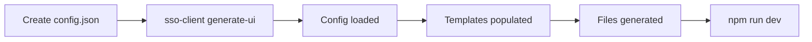

# SSO Client Configuration Guide

A complete step-by-step guide to customizing your SSO-powered application using `sso-client.config.json`.

---

## Quick Start

### Step 1: Create the Config File

In your project root (where you run `sso-client` commands), create:

```bash
touch sso-client.config.json
```

### Step 2: Add Basic Configuration

```json
{
  "$schema": "./sso-client.config.schema.json",
  "theme": "corporate",
  "features": {
    "enableIdleTimeout": true
  }
}
```

### Step 3: Regenerate Your App

```bash
sso-client generate-ui
npm run dev
```

---

## Configuration Options

### 🌐 Network Settings

| Option | Type | Default | Description |
|--------|------|---------|-------------|
| `protocol` | `"http"` \| `"https"` | `"https"` | Service protocol |
| `domain` | string | `"local.test"` | Base domain |
| `authServicePort` | number | `4000` | Auth API port |
| `accountUiPort` | number | `5174` | Account UI port |

**Example:**
```json
{
  "protocol": "https",
  "domain": "mycompany.com",
  "authServicePort": 4000,
  "accountUiPort": 5174
}
```

---

### 🎨 Themes

| Theme | Primary Color | Style |
|-------|---------------|-------|
| `default` | `#6366f1` | Purple gradient |
| `corporate` | `#1e40af` | Professional blue |
| `modern` | `#059669` | Clean green |
| `sunset` | `#ea580c` | Warm orange |
| `midnight` | `#7c3aed` | Deep violet |

**Example:**
```json
{
  "theme": "corporate"
}
```

**Result:** All generated Login, Dashboard, Header components use the corporate blue color scheme.

---

### ⚡ Feature Flags

#### Authentication Features
| Flag | Default | Description |
|------|---------|-------------|
| `enableMFA` | `true` | Multi-Factor Authentication |
| `enableSocialLogin` | `true` | Google, GitHub login |
| `enablePasswordless` | `false` | Magic link login |

#### Session Security
| Flag | Default | Description |
|------|---------|-------------|
| `enableIdleTimeout` | `true` | Logout after inactivity |
| `enableCrossTabSync` | `true` | Sync logout across tabs |
| `enableSessionValidation` | `true` | Periodic session check |
| `enableProactiveRefresh` | `true` | Auto-refresh tokens |

#### UI Features
| Flag | Default | Description |
|------|---------|-------------|
| `enableDarkMode` | `true` | Dark theme support |
| `enableThemeSwitcher` | `true` | UI theme toggle |

#### Development Features
| Flag | Default | Description |
|------|---------|-------------|
| `generateTests` | `false` | Generate unit tests |
| `generateStorybook` | `false` | Generate UI stories |
| `generateDocker` | `false` | Docker config files |

**Example:**
```json
{
  "features": {
    "enableIdleTimeout": true,
    "enableCrossTabSync": true,
    "enableDarkMode": true,
    "generateTests": false
  }
}
```

---

### 🔐 Session Security

| Setting | Default | Range | Description |
|---------|---------|-------|-------------|
| `tokenRefreshBuffer` | `120` | 30-600 sec | Refresh before expiry |
| `sessionValidationInterval` | `300000` | 60000-3600000 ms | Check interval (5 min) |
| `idleTimeoutMs` | `1800000` | 300000-86400000 ms | Idle logout (30 min) |
| `skipValidationWhenHidden` | `true` | boolean | Skip when tab hidden |
| `validateOnVisibility` | `false` | boolean | Check on tab focus |
| `apiTimeout` | `10000` | 5000-60000 ms | API request timeout |
| `validationRetries` | `3` | 1-10 | Retry attempts |
| `retryDelay` | `1000` | 500-10000 ms | Retry delay |

**Example: High-Security Banking App**
```json
{
  "session": {
    "idleTimeoutMs": 300000,
    "tokenRefreshBuffer": 60,
    "sessionValidationInterval": 60000,
    "validateOnVisibility": true
  }
}
```

**Example: Relaxed Dashboard App**
```json
{
  "session": {
    "idleTimeoutMs": 3600000,
    "tokenRefreshBuffer": 300,
    "sessionValidationInterval": 600000
  }
}
```

---

## Complete Examples

### Example 1: Corporate Enterprise App

```json
{
  "$schema": "./sso-client.config.schema.json",
  "protocol": "https",
  "domain": "enterprise.local",
  "theme": "corporate",
  "features": {
    "enableMFA": true,
    "enableIdleTimeout": true,
    "enableCrossTabSync": true,
    "enableAuditLogs": true,
    "enableDarkMode": false
  },
  "session": {
    "idleTimeoutMs": 900000,
    "tokenRefreshBuffer": 60,
    "sessionValidationInterval": 120000
  }
}
```

### Example 2: Developer Dashboard

```json
{
  "$schema": "./sso-client.config.schema.json",
  "theme": "modern",
  "features": {
    "enableIdleTimeout": false,
    "enableDarkMode": true,
    "enableThemeSwitcher": true,
    "generateTests": true
  },
  "session": {
    "idleTimeoutMs": 7200000,
    "skipValidationWhenHidden": true
  }
}
```

### Example 3: Minimal Setup

```json
{
  "theme": "default"
}
```

---

## Environment Variable Overrides

You can also override settings via environment variables:

```bash
export SSO_PROTOCOL=https
export SSO_DOMAIN=myapp.com
export SSO_AUTH_PORT=4000
export SSO_THEME=corporate
```

**Priority:** Environment variables > Config file > Defaults

---

## Workflow



---

## Troubleshooting

### Config not loading?
1. File must be named exactly `sso-client.config.json`
2. Must be in project root (same folder as `package.json`)
3. Must be valid JSON (no trailing commas)

### Verify config is loaded:
```bash
sso-client generate-ui
# Look for: "Config loaded from sso-client.config.json"
```

### Reset to defaults:
```bash
rm sso-client.config.json
sso-client generate-ui
```
